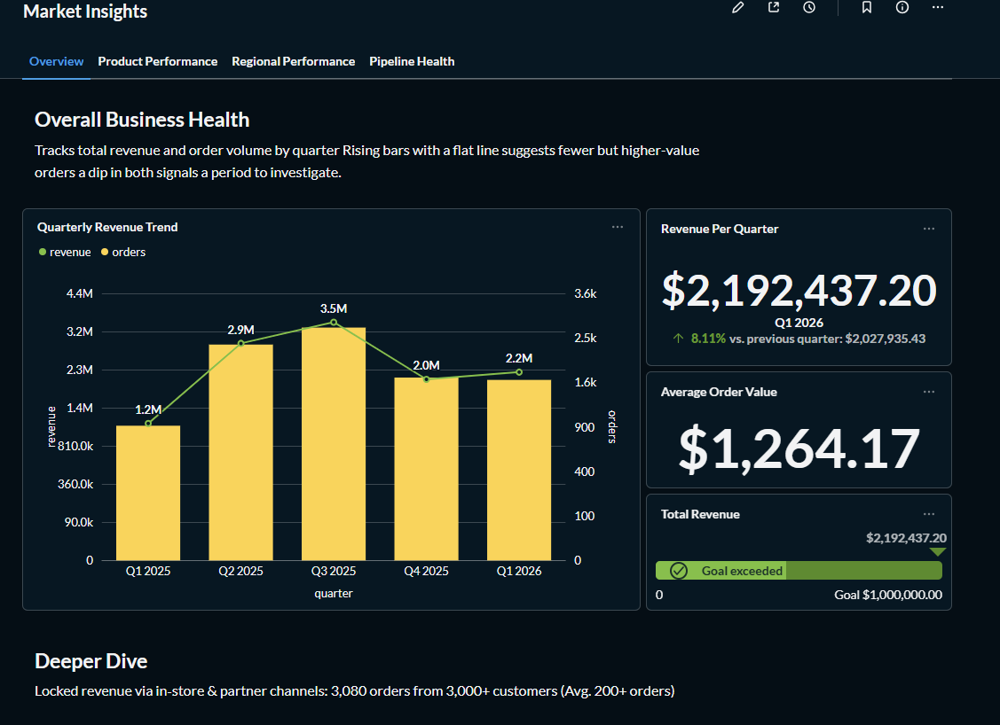
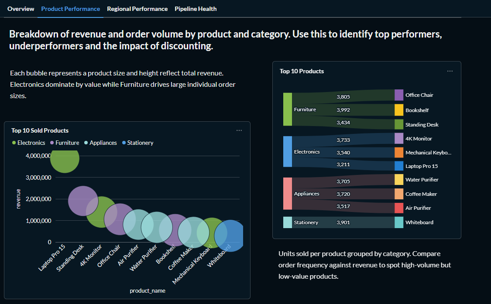
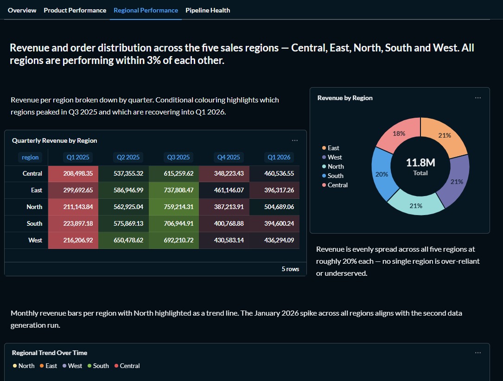
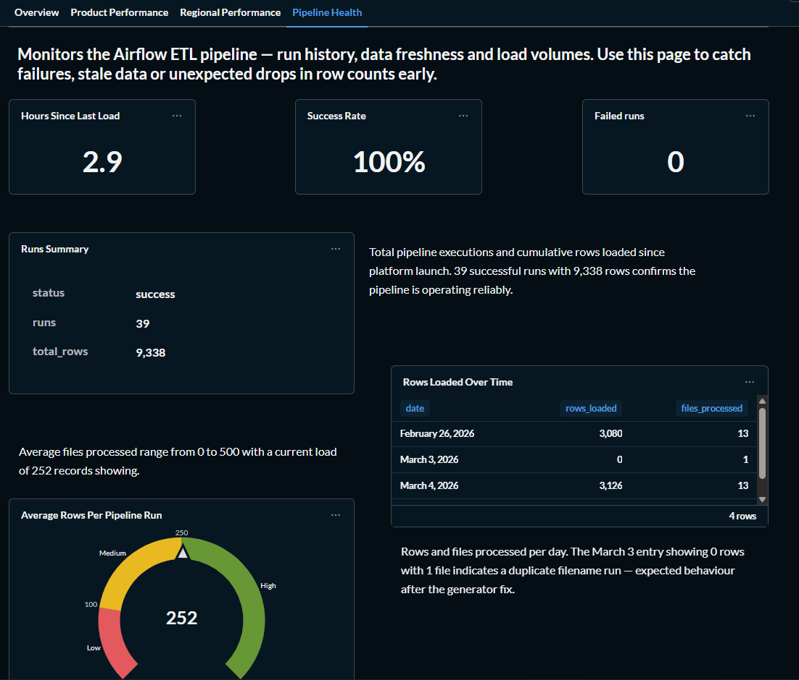

# 📊 Sales Data Platform

A fully containerised sales data platform built with Docker Compose that covers the complete data lifecycle — **ingest → process → store → visualise**. Built using industry-standard open source tools that mirror what real companies run at scale.

> **Author:** Solo Project

---

## 📐 Architecture

```
┌─────────────────────────────────────────────────────────────────────┐
│                        Mini Data Platform                           │
│                                                                     │
│  ┌──────────────┐    ┌──────────────┐    ┌──────────────────────┐  │
│  │    Data      │    │    MinIO     │    │   Apache Airflow     │  │
│  │  Generator   │───▶│  (S3-like)   │───▶│   (Orchestrator)     │  │
│  │              │    │  Port 9000   │    │   Port 8080          │  │
│  │ Python +     │    │  Port 9001   │    │                      │  │
│  │ Faker        │    │  (Console)   │    │  ┌────────────────┐  │  │
│  └──────────────┘    └──────────────┘    │  │ sales_pipeline │  │  │
│                                          │  │ validation_dag │  │  │
│                                          │  └────────────────┘  │  │
│                                          └──────────┬───────────┘  │
│                                                     │              │
│                                                     ▼              │
│                 ┌────────────────────────────────────────────────┐ │
│                 │            PostgreSQL  (Port 5432)             │ │
│                 │                                                │ │
│                 │  ┌─────────────┐   ┌──────────────────────┐   │ │
│                 │  │dim_products │   │     fact_sales        │   │ │
│                 │  │dim_customers│   │  mv_monthly_sales     │   │ │
│                 │  └─────────────┘   │  pipeline_runs        │   │ │
│                 │                    └──────────────────────┘    │ │
│                 └───────────────────────────┬────────────────────┘ │
│                                             │                      │
│                                             ▼                      │
│                 ┌────────────────────────────────────────────────┐ │
│                 │            Metabase  (Port 3000)               │ │
│                 │                                                │ │
│                 │  📊 Sales Overview     🏆 Product Performance  │ │
│                 │  📍 Regional Analysis  ⚙️  Pipeline Health      │ │
│                 └────────────────────────────────────────────────┘ │
└─────────────────────────────────────────────────────────────────────┘
```

### Data Flow

```
CSV Files ──▶ MinIO (raw/) ──▶ Airflow DAG ──▶ PostgreSQL ──▶ Metabase
              Object Store      Validates &      Star Schema    Dashboards
                                Transforms       + Views
                   │                                  │
                   ▼                                  ▼
            MinIO (archive/)                  mv_monthly_sales
            Processed files                  (Materialised View)
```

---

## 🛠️ Tech Stack

| Component | Technology | Purpose | Port |
|-----------|-----------|---------|------|
| **Storage** | MinIO | S3-compatible object store — holds raw & archived CSV files | 9000 / 9001 |
| **Processing** | Apache Airflow 2.8 | Orchestrates the ETL pipeline on a schedule | 8080 |
| **Database** | PostgreSQL 15 | Star schema data warehouse + analytical views | 5432 |
| **BI** | Metabase | Dashboards and visualisations | 3000 |
| **Generator** | Python + Faker | Produces synthetic sales data for testing | — |

---

## 🗂️ Project Structure

```
mini-data-platform/
│
├── 📄 docker-compose.yml          # Orchestrates all 7 containers
├── 📄 Dockerfile                  # Multi-stage: airflow + generator targets
├── 📄 requirements.txt            # All Python dependencies in one file
├── 📄 .env                        # All config and credentials (never commit)
├── 📄 .env.example                # Safe template to commit
├── 📄 .gitignore
├── 📄 Makefile                    # Helper commands
│
├── 📁 scripts/
│   └── 📄 init_db.sql             # PostgreSQL schema, views & seed data
│
├── 📁 dags/
│   ├── 📄 sales_pipeline.py       # Main ETL DAG — runs hourly
│   └── 📄 data_flow_validation.py # Health check DAG — manual / CI trigger
│
├── 📁 data-generator/
│   └── 📄 generate_data.py        # Generates ~2,300 sales records across 13 CSV files
│
└── 📁 .github/
    └── 📁 workflows/
        ├── 📄 ci.yml              # Lint → Build → Integration test on every push
        └── 📄 cd.yml              # Full deploy + validation on merge to main
```

---

## 🚀 Quick Start

### Prerequisites

- [Docker](https://docs.docker.com/get-docker/) ≥ 24.0
- [Docker Compose](https://docs.docker.com/compose/install/) ≥ 2.20
- 6 GB free RAM
- 4 GB free disk space

### 1. Clone the Repository

```bash
git clone https://github.com/YOUR_ORG/mini-data-platform.git
cd mini-data-platform
```

### 2. Configure Environment

```bash
cp .env.example .env
# The defaults work out of the box — edit .env to change credentials
```

### 3. Start All Services

```bash
docker compose up -d
```

First run takes 3–5 minutes to pull images and initialise Airflow.

### 4. Wait for Airflow to Initialise

```bash
# Follow init logs
docker compose logs -f airflow-init
# Wait for "Airflow initialised" then check health
curl http://localhost:8080/health
```

### 5. Generate Sample Data

```bash
docker compose run --rm data-generator
```

Uploads 13 CSV files (~2,300 sales records) to MinIO.

### 6. Trigger the Pipeline

```bash
docker compose exec airflow-scheduler airflow dags trigger sales_pipeline
```

Or wait — it runs automatically every hour.

### 7. Open the Dashboards

Visit [http://localhost:3000](http://localhost:3000) and complete the Metabase setup wizard.

---

## 🔗 Service URLs & Credentials

| Service | URL | Credentials |
|---------|-----|-------------|
| Airflow | http://localhost:8080 | `admin` / `admin` |
| MinIO Console | http://localhost:9001 | `minio` / `minio123` |
| Metabase | http://localhost:3000 | Set on first visit |
| PostgreSQL | `localhost:5432` | `datauser` / `datapass` — db: `salesdb` |

> All credentials are configurable via `.env`

---

## 🗄️ Database Schema

```
┌────────────────────┐       ┌─────────────────────────────────────┐
│   dim_customers    │       │            fact_sales               │
├────────────────────┤       ├─────────────────────────────────────┤
│ customer_id  (PK)  │◀──────│ customer_id  (FK)                   │
│ customer_name      │       │ product_id   (FK)                   │
│ email              │       │ sale_id      (PK)                   │
│ region             │       │ order_id     (UNIQUE)               │
└────────────────────┘       │ sale_date                           │
                             │ quantity                            │
┌────────────────────┐       │ unit_price                          │
│   dim_products     │       │ discount                            │
├────────────────────┤       │ total_amount (generated)            │
│ product_id   (PK)  │◀──────│ region                              │
│ product_name       │       │ channel                             │
│ category           │       │ source_file                         │
│ unit_price         │       └─────────────────────────────────────┘
└────────────────────┘

Materialised View : mv_monthly_sales
Analytical Views  : v_product_performance, v_regional_performance
Audit Table       : pipeline_runs
```

---

## ⚙️ Airflow Pipelines

### `sales_pipeline` — runs hourly

```
list_new_files
      │
      ▼
validate_files        ← schema check, null detection
      │
      ▼
process_and_load      ← clean, upsert into fact/dim tables
      │
      ├──▶ refresh_materialized_views
      ├──▶ archive_files              ← raw/ → archive/ in MinIO
      └──▶ log_runs                   ← audit trail in pipeline_runs
```

### `data_flow_validation` — manual / CI trigger

Validates every hop end-to-end:
- MinIO connectivity and bucket existence
- PostgreSQL schema and table presence
- Row counts across all tables
- Materialised view population
- MinIO upload/download round-trip

---

## 📊 Metabase Dashboards

Four dashboards built on top of five reusable **Models**:

| Model | Source | Purpose |
|-------|--------|---------|
| `Sales Core` | `fact_sales` + joins | Master model for all sales questions |
| `Monthly Revenue` | `mv_monthly_sales` | Pre-aggregated monthly metrics |
| `Product Performance` | `v_product_performance` | Per-product analytics |
| `Regional Performance` | `v_regional_performance` | Per-region analytics |
| `Pipeline Health` | `pipeline_runs` | ETL monitoring |

### Dashboard 1 — Sales Overview
High-level business health: revenue trends, order volume, channel breakdown, quarterly performance and customer counts.

### Dashboard 2 — Product Performance
Top products by revenue, category breakdown, discount impact and category trends over time.

### Dashboard 3 — Regional Performance
Revenue and orders by region, region × channel breakdown and regional trends over time.

### Dashboard 4 — Pipeline Health
Pipeline run history, rows loaded per file, data freshness indicator and error monitoring.

---

## 🔄 CI/CD Pipeline

### CI — runs on every push

1. **Lint** — flake8 on all DAGs and generator code
2. **Build** — Docker image built for both `airflow` and `generator` stages
3. **Integration Test** — spins up Postgres + MinIO, runs generator, verifies files land correctly
4. **Security Scan** — pip-audit on all Python dependencies

### CD — runs on merge to `main`

1. Writes `.env` from GitHub Secrets
2. Deploys full stack with `docker compose up -d`
3. Runs data generator to seed MinIO
4. Triggers `sales_pipeline` DAG
5. Triggers `data_flow_validation` DAG
6. Prints end-to-end metrics report
7. Tears down test environment

---

## 🧰 Useful Commands

```bash
make up           # Start all services
make down         # Stop services (keep data)
make clean        # Stop and wipe all volumes
make logs         # Follow all logs
make ps           # Show container status
make generate     # Upload sample data to MinIO
make trigger      # Trigger the sales pipeline DAG
make validate     # Trigger the validation DAG
make health       # Check all 4 services are alive
make shell-pg     # Open psql prompt to salesdb
make shell-airflow # Open bash in Airflow scheduler
```

---

## 🔧 Troubleshooting

| Problem | Solution |
|---------|----------|
| Airflow not starting | Run `docker compose logs airflow-init` and wait for `"Airflow initialised"` |
| DAG not found | Wait 30s for scheduler to scan — run `airflow dags list` to confirm |
| Metabase blank screen | JVM takes 2–3 min to boot — refresh after waiting |
| MinIO has no files | Re-run `docker compose run --rm data-generator` |
| `must be owner of materialized view` | Run `docker compose exec postgres psql -U admin -d salesdb -c "ALTER MATERIALIZED VIEW mv_monthly_sales OWNER TO datauser;"` |
| Port already in use | Update the port in `.env` and restart |

---

## 📸 Dashboard Screenshots

> Screenshots taken from the live platform running locally via Docker Compose.

### Sales Overview

*High-level KPIs — total revenue, orders, customers, quarterly trends and channel breakdown.*

### Product Performance

*Top 10 products by revenue, category breakdown and discount impact analysis.*

### Regional Performance

*Revenue and order distribution across regions with quarterly pivot breakdown.*

### Pipeline Health

*Airflow pipeline run history, rows loaded per file and data freshness monitoring.*

> 📁 All screenshots stored in the `/screenshots` folder of this repository.

---

## 🌍 Real World Equivalents

| This Platform | Production Equivalent |
|--------------|----------------------|
| MinIO | AWS S3 / Google Cloud Storage |
| Airflow DAGs | ETL pipelines at Uber, Airbnb, Netflix |
| PostgreSQL star schema | Snowflake, Redshift, BigQuery |
| Metabase | Tableau, Looker, Power BI |
| `.env` config | AWS Secrets Manager |
| GitHub Actions | Jenkins, CircleCI, GitLab CI |

---

## 📜 License

MIT © Mini Data Platform